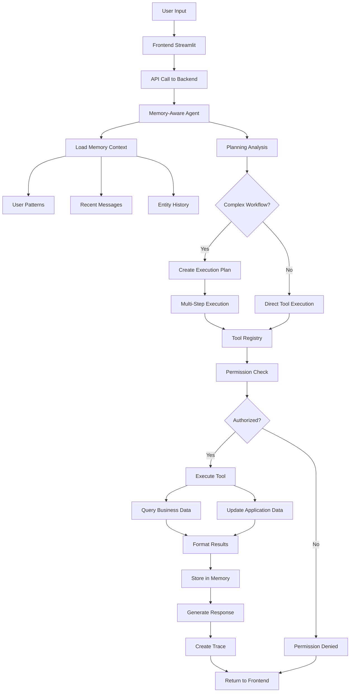
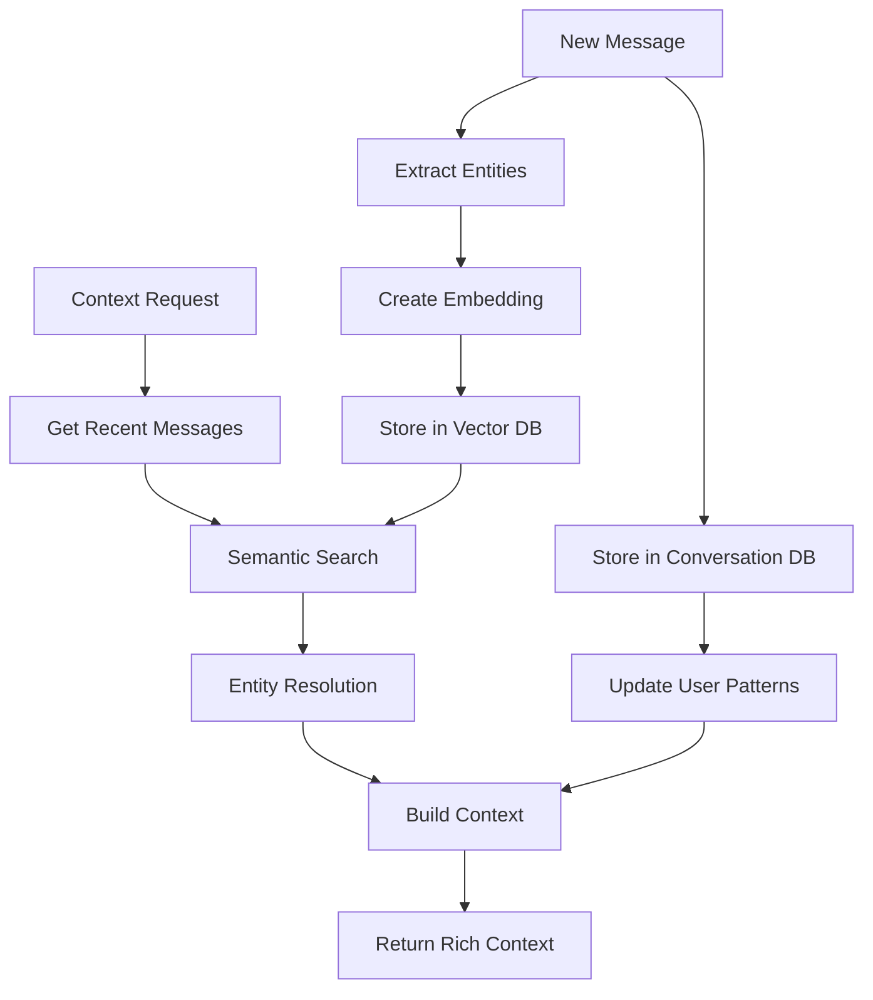

# FinkraftAI Technical Architecture Documentation

## Table of Contents

1. [System Overview](#system-overview)
2. [Architecture Diagrams](#architecture-diagrams)
3. [Component Details](#component-details)
4. [Data Flow](#data-flow)
5. [Database Schema](#database-schema)
6. [API Specifications](#api-specifications)
7. [Security Model](#security-model)
8. [Deployment Architecture](#deployment-architecture)
9. [Performance Considerations](#performance-considerations)
10. [Development Guidelines](#development-guidelines)

---

## System Overview

FinkraftAI is a unified in-app business assistant that enables natural language interaction with business data and processes. The system combines advanced AI capabilities with robust backend services to provide ChatGPT-style intelligence for business operations.

### Core Capabilities

- **Natural Language Processing**: Gemini 1.5 Flash LLM integration for intent understanding
- **Memory System**: ChatGPT-style conversation memory with FAISS vector storage
- **Planning Engine**: Multi-step business workflow orchestration
- **Real Data Integration**: External business database connectivity
- **Role-Based Security**: Enterprise-grade permission management
- **Execution Tracing**: Comprehensive audit and observability

### Technology Stack

**Backend:**
- **Framework**: FastAPI (Python 3.10+)
- **AI/ML**: Google Gemini 1.5 Flash, FAISS, Sentence Transformers
- **Database**: SQLite3 (Application), External Business DB Support
- **Memory**: Vector embeddings with semantic search
- **Authentication**: Role-based access control (RBAC)

**Frontend:**
- **Framework**: Streamlit
- **UI Components**: Custom CSS, Pandas DataFrames
- **Communication**: REST API calls to backend

**Infrastructure:**
- **Application Database**: SQLite3 with comprehensive schema
- **Business Database**: External database connector (multi-DB support)
- **Vector Storage**: FAISS with sentence transformer embeddings
- **Session Management**: In-memory + database persistence

---

## Architecture Diagrams

### High-Level System Architecture

```
┌─────────────────────────────────────────────────────────────────┐
│                          FinkraftAI System                      │
├─────────────────────────────────────────────────────────────────┤
│                                                                 │
│  ┌─────────────────┐    ┌─────────────────┐    ┌──────────────┐ │
│  │   Frontend      │    │     Backend     │    │   External   │ │
│  │   (Streamlit)   │◄──►│    (FastAPI)    │◄──►│  Business    │ │
│  │                 │    │                 │    │   Database   │ │
│  │ • Chat UI       │    │ • Memory Agent  │    │              │ │
│  │ • Dashboard     │    │ • Planning      │    │ • Invoices   │ │
│  │ • Admin Panel   │    │ • Tool Registry │    │ • Sales      │ │
│  └─────────────────┘    └─────────────────┘    │ • Vendors    │ │
│                                                 └──────────────┘ │
│                         ┌─────────────────┐                     │
│                         │  Application    │                     │
│                         │   Database      │                     │
│                         │   (SQLite3)     │                     │
│                         │                 │                     │
│                         │ • Users/Roles   │                     │
│                         │ • Conversations │                     │
│                         │ • Memory/Traces │                     │
│                         │ • Tickets       │                     │
│                         └─────────────────┘                     │
│                                                                 │
│                         ┌─────────────────┐                     │
│                         │  Vector Store   │                     │
│                         │    (FAISS)      │                     │
│                         │                 │                     │
│                         │ • Embeddings    │                     │
│                         │ • Semantic      │                     │
│                         │   Search        │                     │
│                         └─────────────────┘                     │
└─────────────────────────────────────────────────────────────────┘
```

### Backend Component Architecture

```
┌─────────────────────────────────────────────────────────────────┐
│                        Backend Services                         │
├─────────────────────────────────────────────────────────────────┤
│                                                                 │
│  ┌─────────────────┐    ┌─────────────────┐    ┌──────────────┐ │
│  │   API Layer     │    │   Core Engine   │    │   Data Layer │ │
│  │   (FastAPI)     │    │                 │    │              │ │
│  │                 │    │                 │    │              │ │
│  │ • Chat Routes   │◄──►│ Memory Manager  │◄──►│ Repositories │ │
│  │ • Ticket Routes │    │ Planning Engine │    │              │ │
│  │ • Admin Routes  │    │ Tool Registry   │    │ • User Repo  │ │
│  │ • Memory Routes │    │ Vector Store    │    │ • Ticket     │ │
│  │ • Planning      │    │                 │    │ • Permission │ │
│  └─────────────────┘    └─────────────────┘    └──────────────┘ │
│                                                                 │
│  ┌─────────────────┐    ┌─────────────────┐    ┌──────────────┐ │
│  │   AI/ML Layer   │    │   Tools Layer   │    │   Services   │ │
│  │                 │    │                 │    │              │ │
│  │ • Gemini Agent  │    │ • Filter Tool   │    │ • Auth       │ │
│  │ • Embeddings    │    │ • Export Tool   │    │ • Trace      │ │
│  │ • Semantic      │    │ • Ticket Tools  │    │ • Workspace  │ │
│  │   Search        │    │ • Planning      │    │ • Context    │ │
│  │ • Intent        │    │   Templates     │    │ • Session    │ │
│  │   Recognition   │    │                 │    │              │ │
│  └─────────────────┘    └─────────────────┘    └──────────────┘ │
└─────────────────────────────────────────────────────────────────┘
```

---

## Component Details

### 1. Memory-Aware Agent (Core AI Engine)

**Location**: `backend/core/memory_aware_agent.py`

**Responsibilities**:
- Natural language understanding and intent recognition
- Memory-driven conversation context management
- Tool selection and parameter extraction
- Response generation with business context

**Key Features**:
- ChatGPT-style conversation continuity
- Cross-session memory persistence
- Entity resolution ("those invoices" → specific records)
- Planning integration for complex workflows

**Dependencies**:
- Google Gemini 1.5 Flash LLM
- Memory Manager for context retrieval
- Tool Registry for execution
- Trace Service for audit logging

### 2. Memory Management System

**Components**:
- **Memory Manager** (`backend/core/memory_manager.py`)
- **Vector Store** (`backend/core/vector_store.py`) 
- **Context Manager** (`backend/core/context_manager.py`)

**Architecture**:
```
Memory System
├── Contextual Memory (Working Memory)
│   ├── Current conversation thread
│   ├── Recent tool executions
│   └── Active user state
├── Semantic Memory (FAISS Vector Store)
│   ├── Conversation embeddings
│   ├── Entity relationships
│   └── Semantic search capabilities
└── Episodic Memory (Database)
    ├── Complete conversation logs
    ├── User behavioral patterns
    └── Cross-session continuity
```

**Technical Implementation**:
- **Vector Embeddings**: 384-dimensional using `all-MiniLM-L6-v2`
- **Storage**: FAISS IndexFlatIP for cosine similarity
- **Persistence**: SQLite3 + binary vector storage
- **Search**: Semantic similarity with relevance scoring

### 3. Planning Engine

**Location**: `backend/core/planning_engine.py`

**Architecture**:
```
Planning Engine
├── Request Analysis
│   ├── Complexity scoring
│   ├── Template matching
│   └── Intent classification
├── Plan Creation
│   ├── Business process templates
│   ├── Step dependency resolution
│   └── Parameter injection
└── Execution Orchestration
    ├── Sequential execution
    ├── Error handling & retry
    └── Result aggregation
```

**Business Templates**:
- **Invoice Investigation**: Filter → Analyze → Create Ticket
- **Vendor Analysis**: Data Gathering → Performance Analysis → Reporting
- **Monthly Review**: Data Collection → Summary → Export

### 4. Tool Registry & Execution

**Components**:
- **Tool Registry** (`backend/core/tool_registry.py`)
- **Base Tool** (`backend/tools/base_tool.py`)
- **Individual Tools** (`backend/tools/`)

**Tool Architecture**:
```
Tool System
├── Base Tool (Abstract)
│   ├── Parameter definition
│   ├── Permission checking
│   └── Result formatting
├── Data Tools
│   ├── FilterDataTool
│   └── ExportTool
├── Ticket Tools
│   ├── CreateTicketTool
│   ├── ViewTicketsTool
│   └── UpdateTicketTool
└── Registry Management
    ├── Permission validation
    ├── Tool discovery
    └── Execution orchestration
```

---

## Data Flow

### User Request Processing Flow



### Memory System Flow



---

## Database Schema

### Application Database (SQLite3)

The application database contains all system-related data including users, conversations, memory, and tickets.

#### Core Tables

**Users & Authentication**
```sql
-- Users table
users (
    user_id TEXT PRIMARY KEY,
    username TEXT NOT NULL,
    email TEXT,
    full_name TEXT,
    workspace_id TEXT DEFAULT 'default',
    is_active BOOLEAN DEFAULT TRUE,
    created_at DATETIME DEFAULT CURRENT_TIMESTAMP
)

-- Permission groups (roles)
permission_groups (
    id INTEGER PRIMARY KEY,
    group_name TEXT UNIQUE NOT NULL,  -- Admin, Manager, Viewer
    description TEXT,
    can_see_traces BOOLEAN DEFAULT FALSE
)

-- User group assignments
user_groups (
    user_id INTEGER REFERENCES users(id),
    group_id INTEGER REFERENCES permission_groups(id),
    assigned_at DATETIME DEFAULT CURRENT_TIMESTAMP
)
```

**Memory & Conversations**
```sql
-- Conversation threads
conversation_threads (
    thread_id TEXT PRIMARY KEY,
    user_id TEXT REFERENCES users(user_id),
    title TEXT,
    thread_type TEXT DEFAULT 'general',
    is_active BOOLEAN DEFAULT TRUE,
    started_at DATETIME DEFAULT CURRENT_TIMESTAMP,
    last_activity DATETIME DEFAULT CURRENT_TIMESTAMP
)

-- Individual messages
conversations (
    id INTEGER PRIMARY KEY,
    thread_id TEXT REFERENCES conversation_threads(thread_id),
    user_id TEXT REFERENCES users(user_id),
    role TEXT NOT NULL,  -- 'user' or 'assistant'
    message TEXT NOT NULL,
    tool_name TEXT,
    tool_parameters TEXT,  -- JSON
    tool_result TEXT,      -- JSON
    importance_score REAL DEFAULT 0.5,
    timestamp DATETIME DEFAULT CURRENT_TIMESTAMP
)

-- Vector embeddings for semantic search
memory_embeddings (
    id INTEGER PRIMARY KEY,
    content_id INTEGER REFERENCES conversations(id),
    content_type TEXT NOT NULL,
    embedding_vector BLOB NOT NULL,  -- Serialized numpy array
    content_text TEXT NOT NULL,
    metadata TEXT,  -- JSON
    created_at DATETIME DEFAULT CURRENT_TIMESTAMP
)
```

**Business Data & Tickets**
```sql
-- Support tickets
tickets (
    id INTEGER PRIMARY KEY,
    ticket_id TEXT UNIQUE NOT NULL,
    title TEXT NOT NULL,
    description TEXT,
    status TEXT DEFAULT 'open',
    priority TEXT DEFAULT 'medium',
    created_by TEXT REFERENCES users(user_id),
    assigned_to TEXT,
    workspace_id TEXT DEFAULT 'default',
    created_at DATETIME DEFAULT CURRENT_TIMESTAMP,
    updated_at DATETIME DEFAULT CURRENT_TIMESTAMP
)

-- Execution traces for audit
traces (
    id INTEGER PRIMARY KEY,
    trace_id TEXT UNIQUE NOT NULL,
    user_id TEXT REFERENCES users(user_id),
    user_message TEXT,
    llm_plan TEXT,
    tool_calls TEXT,  -- JSON
    results TEXT,     -- JSON
    explanation TEXT,
    execution_time_ms INTEGER,
    timestamp DATETIME DEFAULT CURRENT_TIMESTAMP
)
```

### External Business Database

The external business database contains actual business data that users query.

```sql
-- Vendors/Suppliers
vendors (
    id INTEGER PRIMARY KEY,
    vendor_code TEXT UNIQUE,
    vendor_name TEXT NOT NULL,
    gstin TEXT,
    status TEXT DEFAULT 'active'
)

-- Business invoices
invoices (
    id INTEGER PRIMARY KEY,
    invoice_number TEXT UNIQUE,
    vendor_id INTEGER REFERENCES vendors(id),
    invoice_date DATE NOT NULL,
    total_amount DECIMAL(15,2),
    status TEXT DEFAULT 'pending',  -- pending, processed, failed
    payment_status TEXT DEFAULT 'unpaid',
    gstin_verified BOOLEAN DEFAULT FALSE,
    error_message TEXT
)

-- Sales data
sales (
    id INTEGER PRIMARY KEY,
    sale_date DATE NOT NULL,
    customer_name TEXT,
    product_id INTEGER,
    total_amount DECIMAL(15,2),
    region TEXT,
    status TEXT DEFAULT 'completed'
)
```

### Database Relationships

```
┌─────────────────┐    ┌─────────────────┐    ┌─────────────────┐
│     Users       │    │ Conversation    │    │    Tickets      │
│                 │    │   Threads       │    │                 │
│ • user_id (PK)  │◄──►│ • thread_id     │    │ • ticket_id     │
│ • username      │    │ • user_id (FK)  │    │ • created_by    │
│ • role          │    │ • title         │    │ • status        │
└─────────────────┘    │ • is_active     │    └─────────────────┘
                       └─────────────────┘
                                │
                                ▼
                       ┌─────────────────┐    ┌─────────────────┐
                       │ Conversations   │    │ Memory          │
                       │                 │    │ Embeddings      │
                       │ • id (PK)       │◄──►│ • content_id    │
                       │ • thread_id     │    │ • embedding     │
                       │ • message       │    │ • metadata      │
                       │ • tool_calls    │    └─────────────────┘
                       └─────────────────┘
```

---

## API Specifications

### REST API Endpoints

#### Chat & Natural Language
```http
POST /chat
{
  "user_id": "john_doe",
  "message": "Filter invoices for last month",
  "session_id": "optional_session"
}

Response:
{
  "success": true,
  "agent_response": "Found 45 invoices from last month...",
  "tool_used": "filter_data",
  "trace_id": "trace_123",
  "memory_context": {...}
}
```

#### Direct Tool Execution
```http
POST /execute_tool
{
  "user_id": "john_doe",
  "tool_name": "filter_data",
  "params": {
    "dataset": "invoices",
    "period": "last month",
    "vendor": "IndiSky",
    "status": "failed"
  }
}

Response:
{
  "status": "success",
  "message": "Found 7 invoices matching filters",
  "data": {
    "filtered_records": 7,
    "total_records": 124,
    "results": [...]
  }
}
```

#### Memory & Context
```http
GET /memory/{user_id}/search?query=invoice&limit=10

POST /memory/{user_id}/threads/{thread_id}/activate

GET /memory/{user_id}/insights
```

#### Planning & Workflows
```http
POST /plans/create
{
  "user_id": "john_doe",
  "goal": "Investigate invoice failures",
  "template_name": "invoice_investigation"
}

POST /plans/{plan_id}/execute
GET /plans/{plan_id}/status
```

#### Administrative
```http
GET /user/{user_id}/permissions
GET /admin/users
POST /admin/users/{user_id}/roles
```

### WebSocket Support (Future Enhancement)
```javascript
// Real-time updates for:
// - Live chat responses
// - Planning execution progress
// - System notifications
```

---

## Security Model

### Role-Based Access Control (RBAC)

#### Permission Hierarchy
```
┌─────────────────────────────────────────────────────────────┐
│                     Permission Levels                       │
├─────────────────────────────────────────────────────────────┤
│                                                             │
│  Admin Level                                                │
│  ├── All Manager permissions                               │
│  ├── User management                                       │
│  ├── System administration                                 │
│  ├── Trace visibility                                      │
│  └── Permission management                                 │
│                                                             │
│  Manager Level                                              │
│  ├── All Viewer permissions                                │
│  ├── Ticket creation/management                            │
│  ├── Data export                                           │
│  ├── Complex workflow execution                            │
│  └── Business data modifications                           │
│                                                             │
│  Viewer Level                                               │
│  ├── Data filtering/viewing                                │
│  ├── Basic report generation                               │
│  ├── Own ticket viewing                                    │
│  └── Read-only operations                                  │
│                                                             │
└─────────────────────────────────────────────────────────────┘
```

#### Security Implementation
```python
# Permission checking flow
def execute_tool(tool_name, params, user_context):
    # 1. Load user permissions from database
    user_permissions = get_user_permissions(user_context.user_id)
    
    # 2. Check tool permission
    if tool_name not in user_permissions:
        return PermissionDeniedError()
    
    # 3. Check resource-level permissions
    if requires_data_access(tool_name):
        if not can_access_workspace(user_context.workspace_id):
            return AccessDeniedError()
    
    # 4. Execute with audit logging
    audit_log(user_context.user_id, tool_name, params)
    return tool.execute(params, user_context)
```

### Data Security
- **Workspace Isolation**: Multi-tenant data separation
- **Audit Logging**: Complete execution trace storage
- **Session Management**: Secure session handling with timeouts
- **Input Validation**: Parameter sanitization and validation
- **Database Security**: Prepared statements, transaction safety

---

## UML Diagrams

### Class Diagram - Core Components

```
┌─────────────────────────────────────────────────────────────────┐
│                      Core System Classes                        │
├─────────────────────────────────────────────────────────────────┤
│                                                                 │
│  ┌─────────────────┐    ┌─────────────────┐    ┌──────────────┐ │
│  │  MemoryAware    │    │   Planning      │    │ ToolRegistry │ │
│  │     Agent       │    │    Engine       │    │              │ │
│  │                 │    │                 │    │              │ │
│  │ + process_msg() │◄──►│ + analyze_req() │◄──►│ + execute()  │ │
│  │ + plan_memory() │    │ + create_plan() │    │ + get_tools()│ │
│  │ + generate_rsp()│    │ + execute_plan()│    │ + check_perm│ │
│  └─────────────────┘    └─────────────────┘    └──────────────┘ │
│           │                       │                      │      │
│           ▼                       ▼                      ▼      │
│  ┌─────────────────┐    ┌─────────────────┐    ┌──────────────┐ │
│  │   Memory        │    │  ExecutionPlan  │    │   BaseTool   │ │
│  │   Manager       │    │                 │    │  <<abstract>>│ │
│  │                 │    │ + plan_id       │    │              │ │
│  │ + store_conv()  │    │ + steps[]       │    │ + execute()  │ │
│  │ + get_context() │    │ + status        │    │ + get_params │ │
│  │ + search_mem()  │    │ + execute()     │    │ + validate() │ │
│  └─────────────────┘    └─────────────────┘    └──────────────┘ │
│                                                        │         │
│                                                        ▼         │
│                                            ┌──────────────────┐  │
│                                            │  FilterDataTool  │  │
│                                            │  ExportTool      │  │
│                                            │  TicketTool      │  │
│                                            │  ViewTicketTool  │  │
│                                            │  UpdateTicketTool│  │
│                                            └──────────────────┘  │
└─────────────────────────────────────────────────────────────────┘
```

### Sequence Diagram - User Request Flow

```
User    Frontend    Backend    MemoryAgent    ToolRegistry    Database    ExternalDB
 │         │          │            │              │             │           │
 │ "Filter invoices"  │            │              │             │           │
 │────────►│          │            │              │             │           │
 │         │ POST /chat            │              │             │           │
 │         │─────────►│            │              │             │           │
 │         │          │ process_message()         │             │           │
 │         │          │───────────►│              │             │           │
 │         │          │            │ get_context()│             │           │
 │         │          │            │──────────────┼────────────►│           │
 │         │          │            │◄─────────────┼─────────────│           │
 │         │          │            │ plan_with_memory()         │           │
 │         │          │            │──────────────┐             │           │
 │         │          │            │◄─────────────┘             │           │
 │         │          │            │ execute_tool()             │           │
 │         │          │            │──────────────┼────────────►│           │
 │         │          │            │              │ filter_data │           │
 │         │          │            │              │────────────►│           │
 │         │          │            │              │             │ SELECT... │
 │         │          │            │              │             │──────────►│
 │         │          │            │              │             │◄──────────│
 │         │          │            │              │◄────────────│           │
 │         │          │            │◄─────────────┼─────────────│           │
 │         │          │            │ store_conversation()       │           │
 │         │          │            │──────────────┼────────────►│           │
 │         │          │            │ generate_response()        │           │
 │         │          │            │──────────────┐             │           │
 │         │          │            │◄─────────────┘             │           │
 │         │          │◄───────────│              │             │           │
 │         │◄─────────│            │              │             │           │
 │◄────────│          │            │              │             │           │
```

This completes the database schema, API specifications, security model, and UML diagrams. Would you like me to continue with the remaining sections including deployment architecture, performance considerations, and development guidelines?