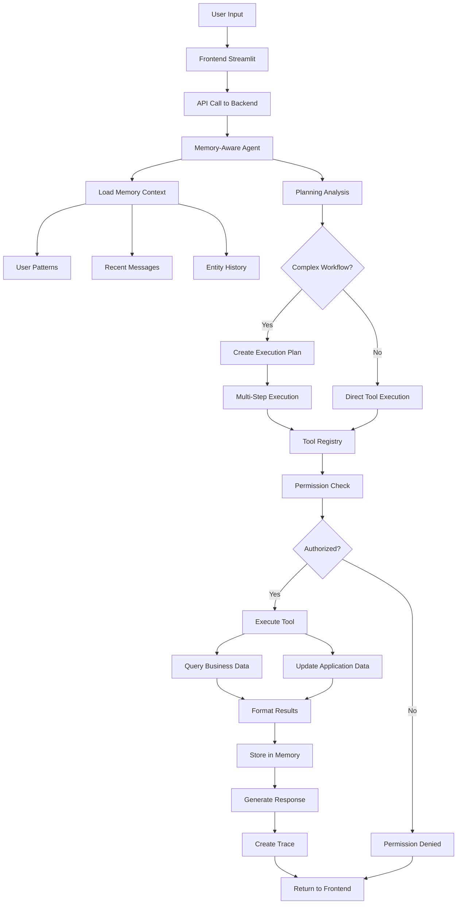
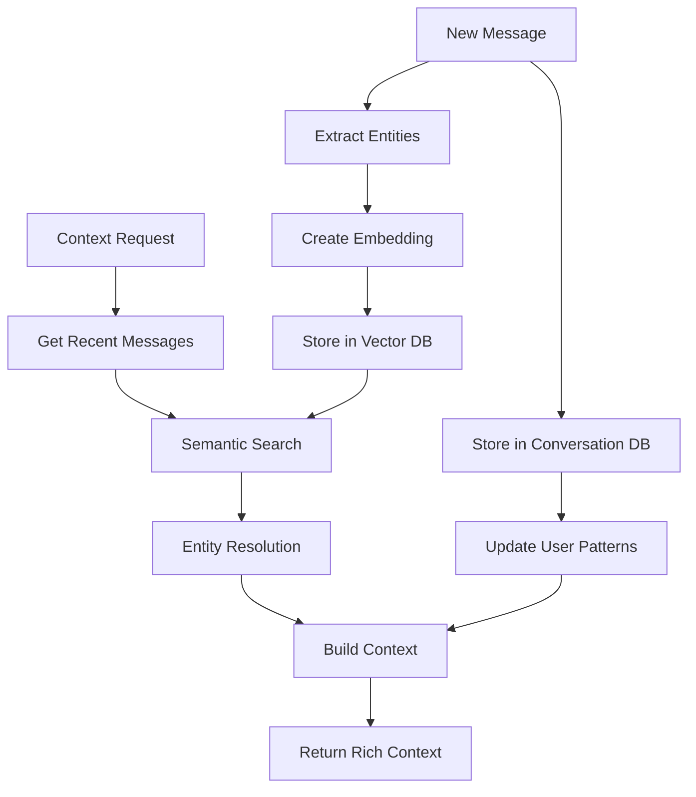

# FinkraftAI Technical Architecture Documentation

## Table of Contents

1. [System Overview](#system-overview)
2. [Architecture Diagrams](#architecture-diagrams)
3. [Component Details](#component-details)
4. [Data Flow](#data-flow)
5. [Database Schema](#database-schema)
6. [API Specifications](#api-specifications)
7. [Security Model](#security-model)
8. [Deployment Architecture](#deployment-architecture)
9. [Performance Considerations](#performance-considerations)
10. [Development Guidelines](#development-guidelines)

---

## System Overview

FinkraftAI is a unified in-app business assistant that enables natural language interaction with business data and processes. The system combines advanced AI capabilities with robust backend services to provide ChatGPT-style intelligence for business operations.

### Core Capabilities

- **Natural Language Processing**: Gemini 1.5 Flash LLM integration for intent understanding
- **Memory System**: ChatGPT-style conversation memory with FAISS vector storage
- **Planning Engine**: Multi-step business workflow orchestration
- **Real Data Integration**: External business database connectivity
- **Role-Based Security**: Enterprise-grade permission management
- **Execution Tracing**: Comprehensive audit and observability

### Technology Stack

**Backend:**
- **Framework**: FastAPI (Python 3.10+)
- **AI/ML**: Google Gemini 1.5 Flash, FAISS, Sentence Transformers
- **Database**: SQLite3 (Application), External Business DB Support
- **Memory**: Vector embeddings with semantic search
- **Authentication**: Role-based access control (RBAC)

**Frontend:**
- **Framework**: Streamlit
- **UI Components**: Custom CSS, Pandas DataFrames
- **Communication**: REST API calls to backend

**Infrastructure:**
- **Application Database**: SQLite3 with comprehensive schema
- **Business Database**: External database connector (multi-DB support)
- **Vector Storage**: FAISS with sentence transformer embeddings
- **Session Management**: In-memory + database persistence

---

## Architecture Diagrams

### High-Level System Architecture

```
┌─────────────────────────────────────────────────────────────────┐
│                          FinkraftAI System                      │
├─────────────────────────────────────────────────────────────────┤
│                                                                 │
│  ┌─────────────────┐    ┌─────────────────┐    ┌──────────────┐ │
│  │   Frontend      │    │     Backend     │    │   External   │ │
│  │   (Streamlit)   │◄──►│    (FastAPI)    │◄──►│  Business    │ │
│  │                 │    │                 │    │   Database   │ │
│  │ • Chat UI       │    │ • Memory Agent  │    │              │ │
│  │ • Dashboard     │    │ • Planning      │    │ • Invoices   │ │
│  │                 │    │ • Tool Registry │    │ • Sales      │ │
│  └─────────────────┘    └─────────────────┘    │ • Vendors    │ │
│                                                └──────────────┘ │
│                         ┌─────────────────┐                     │
│                         │  Application    │                     │
│                         │   Database      │                     │
│                         │   (SQLite3)     │                     │
│                         │                 │                     │
│                         │ • Users/Roles   │                     │
│                         │ • Conversations │                     │
│                         │ • Memory/Traces │                     │
│                         │ • Tickets       │                     │
│                         └─────────────────┘                     │
│                                                                 │
│                         ┌─────────────────┐                     │
│                         │  Vector Store   │                     │
│                         │    (FAISS)      │                     │
│                         │                 │                     │
│                         │ • Embeddings    │                     │
│                         │ • Semantic      │                     │
│                         │   Search        │                     │
│                         └─────────────────┘                     │
└─────────────────────────────────────────────────────────────────┘
```

### Backend Component Architecture

```
┌─────────────────────────────────────────────────────────────────┐
│                        Backend Services                         │
├─────────────────────────────────────────────────────────────────┤
│                                                                 │
│  ┌─────────────────┐    ┌─────────────────┐    ┌──────────────┐ │
│  │   API Layer     │    │   Core Engine   │    │   Data Layer │ │
│  │   (FastAPI)     │    │                 │    │              │ │
│  │                 │    │                 │    │              │ │
│  │ • Chat Routes   │◄──►│ Memory Manager  │◄──►│ Repositories │ │
│  │ • Ticket Routes │    │ Planning Engine │    │              │ │
│  │ • Admin Routes  │    │ Tool Registry   │    │ • User Repo  │ │
│  │ • Memory Routes │    │ Vector Store    │    │ • Ticket     │ │
│  │ • Planning      │    │                 │    │ • Permission │ │
│  └─────────────────┘    └─────────────────┘    └──────────────┘ │
│                                                                 │
│  ┌─────────────────┐    ┌─────────────────┐    ┌──────────────┐ │
│  │   AI/ML Layer   │    │   Tools Layer   │    │   Services   │ │
│  │                 │    │                 │    │              │ │
│  │ • Gemini Agent  │    │ • Filter Tool   │    │ • Auth       │ │
│  │ • Embeddings    │    │ • Export Tool   │    │ • Trace      │ │
│  │ • Semantic      │    │ • Ticket Tools  │    │ • Workspace  │ │
│  │   Search        │    │ • Planning      │    │ • Context    │ │
│  │ • Intent        │    │   Templates     │    │ • Session    │ │
│  │   Recognition   │    │                 │    │              │ │
│  └─────────────────┘    └─────────────────┘    └──────────────┘ │
└─────────────────────────────────────────────────────────────────┘
```

---

## Component Details

### 1. Memory-Aware Agent (Core AI Engine)

**Location**: `backend/core/memory_aware_agent.py`

**Responsibilities**:
- Natural language understanding and intent recognition
- Memory-driven conversation context management
- Tool selection and parameter extraction
- Response generation with business context

**Key Features**:
- ChatGPT-style conversation continuity
- Cross-session memory persistence
- Entity resolution ("those invoices" → specific records)
- Planning integration for complex workflows

**Dependencies**:
- Google Gemini 1.5 Flash LLM
- Memory Manager for context retrieval
- Tool Registry for execution
- Trace Service for audit logging

### 2. Memory Management System

**Components**:
- **Memory Manager** (`backend/core/memory_manager.py`)
- **Vector Store** (`backend/core/vector_store.py`) 
- **Context Manager** (`backend/core/context_manager.py`)

**Architecture**:
```
Memory System
├── Contextual Memory (Working Memory)
│   ├── Current conversation thread
│   ├── Recent tool executions
│   └── Active user state
├── Semantic Memory (FAISS Vector Store)
│   ├── Conversation embeddings
│   ├── Entity relationships
│   └── Semantic search capabilities
└── Episodic Memory (Database)
    ├── Complete conversation logs
    ├── User behavioral patterns
    └── Cross-session continuity
```

**Technical Implementation**:
- **Vector Embeddings**: 384-dimensional using `all-MiniLM-L6-v2`
- **Storage**: FAISS IndexFlatIP for cosine similarity
- **Persistence**: SQLite3 + binary vector storage
- **Search**: Semantic similarity with relevance scoring

### 3. Planning Engine

**Location**: `backend/core/planning_engine.py`

**Architecture**:
```
Planning Engine
├── Request Analysis
│   ├── Complexity scoring
│   ├── Template matching
│   └── Intent classification
├── Plan Creation
│   ├── Business process templates
│   ├── Step dependency resolution
│   └── Parameter injection
└── Execution Orchestration
    ├── Sequential execution
    ├── Error handling & retry
    └── Result aggregation
```

**Business Templates**:
- **Invoice Investigation**: Filter → Analyze → Create Ticket
- **Vendor Analysis**: Data Gathering → Performance Analysis → Reporting
- **Monthly Review**: Data Collection → Summary → Export

### 4. Tool Registry & Execution

**Components**:
- **Tool Registry** (`backend/core/tool_registry.py`)
- **Base Tool** (`backend/tools/base_tool.py`)
- **Individual Tools** (`backend/tools/`)

**Tool Architecture**:
```
Tool System
├── Base Tool (Abstract)
│   ├── Parameter definition
│   ├── Permission checking
│   └── Result formatting
├── Data Tools
│   ├── FilterDataTool
│   └── ExportTool
├── Ticket Tools
│   ├── CreateTicketTool
│   ├── ViewTicketsTool
│   └── UpdateTicketTool
└── Registry Management
    ├── Permission validation
    ├── Tool discovery
    └── Execution orchestration
```

---

## Data Flow

### User Request Processing Flow



### Memory System Flow



---

## Database Schema

### Application Database (SQLite3)

The application database contains all system-related data including users, conversations, memory, and tickets.

#### Core Tables

**Users & Authentication**
```sql
-- Users table
users (
    user_id TEXT PRIMARY KEY,
    username TEXT NOT NULL,
    email TEXT,
    full_name TEXT,
    workspace_id TEXT DEFAULT 'default',
    is_active BOOLEAN DEFAULT TRUE,
    created_at DATETIME DEFAULT CURRENT_TIMESTAMP
)

-- Permission groups (roles)
permission_groups (
    id INTEGER PRIMARY KEY,
    group_name TEXT UNIQUE NOT NULL,  -- Admin, Manager, Viewer
    description TEXT,
    can_see_traces BOOLEAN DEFAULT FALSE
)

-- User group assignments
user_groups (
    user_id INTEGER REFERENCES users(id),
    group_id INTEGER REFERENCES permission_groups(id),
    assigned_at DATETIME DEFAULT CURRENT_TIMESTAMP
)
```

**Memory & Conversations**
```sql
-- Conversation threads
conversation_threads (
    thread_id TEXT PRIMARY KEY,
    user_id TEXT REFERENCES users(user_id),
    title TEXT,
    thread_type TEXT DEFAULT 'general',
    is_active BOOLEAN DEFAULT TRUE,
    started_at DATETIME DEFAULT CURRENT_TIMESTAMP,
    last_activity DATETIME DEFAULT CURRENT_TIMESTAMP
)

-- Individual messages
conversations (
    id INTEGER PRIMARY KEY,
    thread_id TEXT REFERENCES conversation_threads(thread_id),
    user_id TEXT REFERENCES users(user_id),
    role TEXT NOT NULL,  -- 'user' or 'assistant'
    message TEXT NOT NULL,
    tool_name TEXT,
    tool_parameters TEXT,  -- JSON
    tool_result TEXT,      -- JSON
    importance_score REAL DEFAULT 0.5,
    timestamp DATETIME DEFAULT CURRENT_TIMESTAMP
)

-- Vector embeddings for semantic search
memory_embeddings (
    id INTEGER PRIMARY KEY,
    content_id INTEGER REFERENCES conversations(id),
    content_type TEXT NOT NULL,
    embedding_vector BLOB NOT NULL,  -- Serialized numpy array
    content_text TEXT NOT NULL,
    metadata TEXT,  -- JSON
    created_at DATETIME DEFAULT CURRENT_TIMESTAMP
)
```

**Business Data & Tickets**
```sql
-- Support tickets
tickets (
    id INTEGER PRIMARY KEY,
    ticket_id TEXT UNIQUE NOT NULL,
    title TEXT NOT NULL,
    description TEXT,
    status TEXT DEFAULT 'open',
    priority TEXT DEFAULT 'medium',
    created_by TEXT REFERENCES users(user_id),
    assigned_to TEXT,
    workspace_id TEXT DEFAULT 'default',
    created_at DATETIME DEFAULT CURRENT_TIMESTAMP,
    updated_at DATETIME DEFAULT CURRENT_TIMESTAMP
)

-- Execution traces for audit
traces (
    id INTEGER PRIMARY KEY,
    trace_id TEXT UNIQUE NOT NULL,
    user_id TEXT REFERENCES users(user_id),
    user_message TEXT,
    llm_plan TEXT,
    tool_calls TEXT,  -- JSON
    results TEXT,     -- JSON
    explanation TEXT,
    execution_time_ms INTEGER,
    timestamp DATETIME DEFAULT CURRENT_TIMESTAMP
)
```

### External Business Database

The external business database contains actual business data that users query.

```sql
-- Vendors/Suppliers
vendors (
    id INTEGER PRIMARY KEY,
    vendor_code TEXT UNIQUE,
    vendor_name TEXT NOT NULL,
    gstin TEXT,
    status TEXT DEFAULT 'active'
)

-- Business invoices
invoices (
    id INTEGER PRIMARY KEY,
    invoice_number TEXT UNIQUE,
    vendor_id INTEGER REFERENCES vendors(id),
    invoice_date DATE NOT NULL,
    total_amount DECIMAL(15,2),
    status TEXT DEFAULT 'pending',  -- pending, processed, failed
    payment_status TEXT DEFAULT 'unpaid',
    gstin_verified BOOLEAN DEFAULT FALSE,
    error_message TEXT
)

-- Sales data
sales (
    id INTEGER PRIMARY KEY,
    sale_date DATE NOT NULL,
    customer_name TEXT,
    product_id INTEGER,
    total_amount DECIMAL(15,2),
    region TEXT,
    status TEXT DEFAULT 'completed'
)
```

### Database Relationships

```
┌─────────────────┐    ┌─────────────────┐    ┌─────────────────┐
│     Users       │    │ Conversation    │    │    Tickets      │
│                 │    │   Threads       │    │                 │
│ • user_id (PK)  │◄──►│ • thread_id     │    │ • ticket_id     │
│ • username      │    │ • user_id (FK)  │    │ • created_by    │
│ • role          │    │ • title         │    │ • status        │
└─────────────────┘    │ • is_active     │    └─────────────────┘
                       └─────────────────┘
                                │
                                ▼
                       ┌─────────────────┐    ┌─────────────────┐
                       │ Conversations   │    │ Memory          │
                       │                 │    │ Embeddings      │
                       │ • id (PK)       │◄──►│ • content_id    │
                       │ • thread_id     │    │ • embedding     │
                       │ • message       │    │ • metadata      │
                       │ • tool_calls    │    └─────────────────┘
                       └─────────────────┘
```

---

## API Specifications

### REST API Endpoints

#### Chat & Natural Language
```http
POST /chat
{
  "user_id": "john_doe",
  "message": "Filter invoices for last month",
  "session_id": "optional_session"
}

Response:
{
  "success": true,
  "agent_response": "Found 45 invoices from last month...",
  "tool_used": "filter_data",
  "trace_id": "trace_123",
  "memory_context": {...}
}
```

#### Direct Tool Execution
```http
POST /execute_tool
{
  "user_id": "john_doe",
  "tool_name": "filter_data",
  "params": {
    "dataset": "invoices",
    "period": "last month",
    "vendor": "IndiSky",
    "status": "failed"
  }
}

Response:
{
  "status": "success",
  "message": "Found 7 invoices matching filters",
  "data": {
    "filtered_records": 7,
    "total_records": 124,
    "results": [...]
  }
}
```

#### Memory & Context
```http
GET /memory/{user_id}/search?query=invoice&limit=10

POST /memory/{user_id}/threads/{thread_id}/activate

GET /memory/{user_id}/insights
```

#### Planning & Workflows
```http
POST /plans/create
{
  "user_id": "john_doe",
  "goal": "Investigate invoice failures",
  "template_name": "invoice_investigation"
}

POST /plans/{plan_id}/execute
GET /plans/{plan_id}/status
```

#### Administrative
```http
GET /user/{user_id}/permissions
GET /admin/users
POST /admin/users/{user_id}/roles
```

### WebSocket Support (Future Enhancement)
```javascript
// Real-time updates for:
// - Live chat responses
// - Planning execution progress
// - System notifications
```

---

## Security Model

### Role-Based Access Control (RBAC)

#### Permission Hierarchy
```
┌─────────────────────────────────────────────────────────────┐
│                     Permission Levels                       │
├─────────────────────────────────────────────────────────────┤
│                                                             │
│  Admin Level                                                │
│  ├── All Manager permissions                               │
│  ├── User management                                       │
│  ├── System administration                                 │
│  ├── Trace visibility                                      │
│  └── Permission management                                 │
│                                                             │
│  Manager Level                                              │
│  ├── All Viewer permissions                                │
│  ├── Ticket creation/management                            │
│  ├── Data export                                           │
│  ├── Complex workflow execution                            │
│  └── Business data modifications                           │
│                                                             │
│  Viewer Level                                               │
│  ├── Data filtering/viewing                                │
│  ├── Basic report generation                               │
│  ├── Own ticket viewing                                    │
│  └── Read-only operations                                  │
│                                                             │
└─────────────────────────────────────────────────────────────┘
```

#### Security Implementation
```python
# Permission checking flow
def execute_tool(tool_name, params, user_context):
    # 1. Load user permissions from database
    user_permissions = get_user_permissions(user_context.user_id)
    
    # 2. Check tool permission
    if tool_name not in user_permissions:
        return PermissionDeniedError()
    
    # 3. Check resource-level permissions
    if requires_data_access(tool_name):
        if not can_access_workspace(user_context.workspace_id):
            return AccessDeniedError()
    
    # 4. Execute with audit logging
    audit_log(user_context.user_id, tool_name, params)
    return tool.execute(params, user_context)
```

### Data Security
- **Workspace Isolation**: Multi-tenant data separation
- **Audit Logging**: Complete execution trace storage
- **Session Management**: Secure session handling with timeouts
- **Input Validation**: Parameter sanitization and validation
- **Database Security**: Prepared statements, transaction safety

---

## UML Diagrams

### Class Diagram - Core Components

```
┌─────────────────────────────────────────────────────────────────┐
│                      Core System Classes                        │
├─────────────────────────────────────────────────────────────────┤
│                                                                 │
│  ┌─────────────────┐    ┌─────────────────┐    ┌──────────────┐ │
│  │  MemoryAware    │    │   Planning      │    │ ToolRegistry │ │
│  │     Agent       │    │    Engine       │    │              │ │
│  │                 │    │                 │    │              │ │
│  │ + process_msg() │◄──►│ + analyze_req() │◄──►│ + execute()  │ │
│  │ + plan_memory() │    │ + create_plan() │    │ + get_tools()│ │
│  │ + generate_rsp()│    │ + execute_plan()│    │ + check_perm│ │
│  └─────────────────┘    └─────────────────┘    └──────────────┘ │
│           │                       │                      │      │
│           ▼                       ▼                      ▼      │
│  ┌─────────────────┐    ┌─────────────────┐    ┌──────────────┐ │
│  │   Memory        │    │  ExecutionPlan  │    │   BaseTool   │ │
│  │   Manager       │    │                 │    │  <<abstract>>│ │
│  │                 │    │ + plan_id       │    │              │ │
│  │ + store_conv()  │    │ + steps[]       │    │ + execute()  │ │
│  │ + get_context() │    │ + status        │    │ + get_params │ │
│  │ + search_mem()  │    │ + execute()     │    │ + validate() │ │
│  └─────────────────┘    └─────────────────┘    └──────────────┘ │
│                                                        │         │
│                                                        ▼         │
│                                            ┌──────────────────┐  │
│                                            │  FilterDataTool  │  │
│                                            │  ExportTool      │  │
│                                            │  TicketTool      │  │
│                                            │  ViewTicketTool  │  │
│                                            │  UpdateTicketTool│  │
│                                            └──────────────────┘  │
└─────────────────────────────────────────────────────────────────┘
```

### Sequence Diagram - User Request Flow

```
User    Frontend    Backend    MemoryAgent    ToolRegistry    Database    ExternalDB
 │         │          │            │              │             │           │
 │ "Filter invoices"  │            │              │             │           │
 │────────►│          │            │              │             │           │
 │         │ POST /chat            │              │             │           │
 │         │─────────►│            │              │             │           │
 │         │          │ process_message()         │             │           │
 │         │          │───────────►│              │             │           │
 │         │          │            │ get_context()│             │           │
 │         │          │            │──────────────┼────────────►│           │
 │         │          │            │◄─────────────┼─────────────│           │
 │         │          │            │ plan_with_memory()         │           │
 │         │          │            │──────────────┐             │           │
 │         │          │            │◄─────────────┘             │           │
 │         │          │            │ execute_tool()             │           │
 │         │          │            │──────────────┼────────────►│           │
 │         │          │            │              │ filter_data │           │
 │         │          │            │              │────────────►│           │
 │         │          │            │              │             │ SELECT... │
 │         │          │            │              │             │──────────►│
 │         │          │            │              │             │◄──────────│
 │         │          │            │              │◄────────────│           │
 │         │          │            │◄─────────────┼─────────────│           │
 │         │          │            │ store_conversation()       │           │
 │         │          │            │──────────────┼────────────►│           │
 │         │          │            │ generate_response()        │           │
 │         │          │            │──────────────┐             │           │
 │         │          │            │◄─────────────┘             │           │
 │         │          │◄───────────│              │             │           │
 │         │◄─────────│            │              │             │           │
 │◄────────│          │            │              │             │           │
```

---

## Deployment Architecture

### Development Environment

```
┌─────────────────────────────────────────────────────────────────┐
│                    Development Setup                            │
├─────────────────────────────────────────────────────────────────┤
│                                                                 │
│  Local Machine                                                  │
│  ┌─────────────────┐    ┌─────────────────┐    ┌──────────────┐ │
│  │   Terminal 1    │    │   Terminal 2    │    │   Browser    │ │
│  │                 │    │                 │    │              │ │
│  │ Backend Server  │    │ Frontend Server │    │ User Access  │ │
│  │ python run_app  │    │ streamlit run   │    │              │ │
│  │ Port: 8000      │    │ Port: 8501      │    │ :8501        │ │
│  └─────────────────┘    └─────────────────┘    └──────────────┘ │
│                                                                 │
│  ┌─────────────────┐    ┌─────────────────┐    ┌──────────────┐ │
│  │ Application DB  │    │ Business DB     │    │ Vector Store │ │
│  │ finkraftai.db   │    │ business_data.db│    │ FAISS Index  │ │
│  │ (SQLite3)       │    │ (SQLite3)       │    │ + Metadata   │ │
│  └─────────────────┘    └─────────────────┘    └──────────────┘ │
└─────────────────────────────────────────────────────────────────┘
```

### Production Architecture

```
┌─────────────────────────────────────────────────────────────────┐
│                    Production Deployment                        │
├─────────────────────────────────────────────────────────────────┤
│                                                                 │
│  Load Balancer (nginx)                                         │
│  ┌─────────────────────────────────────────────────────────────┐ │
│  │ • SSL Termination                                           │ │
│  │ • Rate Limiting                                             │ │
│  │ • Static Asset Serving                                     │ │
│  └─────────────────────────────────────────────────────────────┘ │
│                              │                                  │
│              ┌───────────────┼───────────────┐                 │
│              ▼               ▼               ▼                 │
│  ┌─────────────────┐ ┌─────────────────┐ ┌─────────────────┐   │
│  │   Frontend      │ │   Backend       │ │   Database      │   │
│  │   Container     │ │   Container     │ │   Cluster       │   │
│  │                 │ │                 │ │                 │   │
│  │ • Streamlit App │ │ • FastAPI       │ │ • PostgreSQL    │   │
│  │ • nginx Proxy   │ │ • Memory System │ │ • Redis Cache   │   │
│  │ • Health Check  │ │ • AI/ML Stack   │ │ • Vector DB     │   │
│  └─────────────────┘ └─────────────────┘ └─────────────────┘   │
│                                                                 │
│  ┌─────────────────────────────────────────────────────────────┐ │
│  │                   External Services                         │ │
│  │                                                             │ │
│  │ • Google Gemini API (LLM)                                  │ │
│  │ • Customer Business Databases                              │ │
│  │ • Monitoring & Alerting                                    │ │
│  │ • Logging & Analytics                                      │ │
│  └─────────────────────────────────────────────────────────────┘ │
└─────────────────────────────────────────────────────────────────┘
```

### Container Architecture

```dockerfile
# Backend Dockerfile
FROM python:3.10-slim

WORKDIR /app
COPY requirements.txt .
RUN pip install -r requirements.txt

COPY backend/ ./backend/
COPY database/ ./database/
COPY external_db/ ./external_db/

EXPOSE 8000
CMD ["uvicorn", "backend.main:app", "--host", "0.0.0.0", "--port", "8000"]
```

```dockerfile
# Frontend Dockerfile  
FROM python:3.10-slim

WORKDIR /app
COPY frontend/requirements.txt .
RUN pip install -r requirements.txt

COPY frontend/ ./frontend/

EXPOSE 8501
CMD ["streamlit", "run", "frontend/app.py", "--server.port", "8501", "--server.address", "0.0.0.0"]
```

### Docker Compose Configuration

```yaml
version: '3.8'

services:
  backend:
    build: 
      context: .
      dockerfile: Dockerfile.backend
    ports:
      - "8000:8000"
    environment:
      - GEMINI_API_KEY=${GEMINI_API_KEY}
      - DATABASE_URL=${DATABASE_URL}
    volumes:
      - ./data:/app/data
    depends_on:
      - database
      - redis
  
  frontend:
    build:
      context: .
      dockerfile: Dockerfile.frontend
    ports:
      - "8501:8501"
    environment:
      - BACKEND_URL=http://backend:8000
    depends_on:
      - backend
  
  database:
    image: postgres:14
    environment:
      - POSTGRES_DB=finkraftai
      - POSTGRES_USER=${DB_USER}
      - POSTGRES_PASSWORD=${DB_PASSWORD}
    volumes:
      - postgres_data:/var/lib/postgresql/data
  
  redis:
    image: redis:alpine
    ports:
      - "6379:6379"
  
  nginx:
    image: nginx:alpine
    ports:
      - "80:80"
      - "443:443"
    volumes:
      - ./nginx.conf:/etc/nginx/nginx.conf
      - ./ssl:/etc/ssl
    depends_on:
      - frontend
      - backend

volumes:
  postgres_data:
```

---

## Performance Considerations

### Scalability Metrics

**Current Capacity (Single Instance)**:
- **Concurrent Users**: 50-100
- **Requests/Second**: 100-200
- **Memory Usage**: 2-4GB RAM
- **Storage**: 10GB+ (grows with conversations)
- **Response Time**: <2s (excluding LLM calls)

### Performance Optimization Strategies

#### 1. Database Optimization

```sql
-- Indexing Strategy
CREATE INDEX idx_conversations_user_time ON conversations(user_id, timestamp);
CREATE INDEX idx_memory_embeddings_content ON memory_embeddings(content_id, content_type);
CREATE INDEX idx_traces_user_date ON traces(user_id, DATE(timestamp));
CREATE INDEX idx_tickets_status_priority ON tickets(status, priority);

-- Query Optimization
-- Use LIMIT for large result sets
-- Implement pagination for conversation history
-- Cache frequent permission lookups
```

#### 2. Memory System Optimization

```python
# Vector Store Performance
class OptimizedVectorStore:
    def __init__(self):
        # Use IVF index for large datasets
        self.index = faiss.IndexIVFFlat(
            quantizer, dimension, nlist=100
        )
        
    def batch_search(self, queries, k=10):
        # Batch processing for multiple queries
        return self.index.search(np.array(queries), k)
    
    def incremental_training(self, new_vectors):
        # Add vectors without full retraining
        self.index.add(new_vectors)
```

#### 3. Caching Strategy

```python
# Multi-level caching
class CacheManager:
    def __init__(self):
        self.memory_cache = {}  # In-process cache
        self.redis_cache = redis.Redis()  # Distributed cache
        
    def get_user_permissions(self, user_id):
        # L1: Memory cache
        if user_id in self.memory_cache:
            return self.memory_cache[user_id]
        
        # L2: Redis cache
        cached = self.redis_cache.get(f"perms:{user_id}")
        if cached:
            perms = json.loads(cached)
            self.memory_cache[user_id] = perms
            return perms
        
        # L3: Database
        perms = self.load_from_database(user_id)
        self.redis_cache.setex(f"perms:{user_id}", 300, json.dumps(perms))
        self.memory_cache[user_id] = perms
        return perms
```

#### 4. Async Processing

```python
# Background task processing
import asyncio
from celery import Celery

# For heavy operations
async def process_large_dataset(user_id, dataset_params):
    task_id = str(uuid.uuid4())
    
    # Queue background processing
    process_dataset_task.delay(task_id, user_id, dataset_params)
    
    return {
        "task_id": task_id,
        "status": "processing",
        "estimated_time": "2-5 minutes"
    }

@celery_app.task
def process_dataset_task(task_id, user_id, params):
    # Heavy processing in background
    results = run_complex_analysis(params)
    
    # Store results
    store_task_results(task_id, results)
    
    # Notify user
    notify_user(user_id, task_id, "completed")
```

### Monitoring & Observability

#### Application Metrics

```python
# Prometheus metrics integration
from prometheus_client import Counter, Histogram, Gauge

# Request metrics
request_count = Counter('finkraftai_requests_total', 'Total requests', ['method', 'endpoint'])
request_duration = Histogram('finkraftai_request_duration_seconds', 'Request duration')
active_users = Gauge('finkraftai_active_users', 'Currently active users')

# Business metrics
tool_executions = Counter('finkraftai_tool_executions_total', 'Tool executions', ['tool_name', 'status'])
memory_operations = Counter('finkraftai_memory_operations_total', 'Memory operations', ['operation'])
llm_calls = Counter('finkraftai_llm_calls_total', 'LLM API calls', ['status'])
```

#### Health Check Endpoints

```python
@app.get("/health")
def health_check():
    return {
        "status": "healthy",
        "timestamp": datetime.utcnow(),
        "version": "1.0.0"
    }

@app.get("/health/detailed")
def detailed_health():
    return {
        "database": check_database_connection(),
        "vector_store": check_vector_store(),
        "external_apis": check_external_services(),
        "memory_usage": get_memory_usage(),
        "active_sessions": get_active_session_count()
    }
```

---

## Development Guidelines

### Code Organization

```
finkraftai/
├── backend/
│   ├── core/                 # Core engine components
│   │   ├── memory_aware_agent.py
│   │   ├── planning_engine.py
│   │   ├── tool_registry.py
│   │   └── vector_store.py
│   ├── tools/                # Individual tool implementations
│   │   ├── filter_data_tool.py
│   │   ├── export_tool.py
│   │   └── ticket_tools.py
│   ├── services/             # Business logic services
│   │   ├── auth_service.py
│   │   ├── conversation_service.py
│   │   └── trace_service.py
│   ├── models/               # Data models
│   │   ├── user.py
│   │   ├── conversation.py
│   │   └── ticket.py
│   ├── routers/              # API route handlers
│   │   ├── tickets.py
│   │   └── admin.py
│   └── main.py               # FastAPI application
├── frontend/
│   ├── app.py                # Main Streamlit application
│   ├── components/           # Reusable UI components
│   └── utils/                # Frontend utilities
├── database/
│   ├── migrations/           # Database schema migrations
│   ├── repositories/         # Data access layer
│   └── connection.py         # Database connection management
├── external_db/              # External database integration
│   ├── business_schema.sql
│   └── business_data.py
├── tests/                    # Test suite
│   ├── unit/
│   ├── integration/
│   └── e2e/
└── docs/                     # Documentation
    ├── api/
    ├── deployment/
    └── user_guides/
```

### Design Patterns

#### 1. Repository Pattern
```python
# Data access abstraction
class UserRepository:
    def get_user(self, user_id: str) -> Optional[User]:
        # Database access logic
        pass
    
    def create_user(self, user: User) -> bool:
        # User creation logic
        pass
```

#### 2. Service Layer Pattern
```python
# Business logic separation
class AuthService:
    def __init__(self, user_repo: UserRepository, permission_repo: PermissionRepository):
        self.user_repo = user_repo
        self.permission_repo = permission_repo
    
    def authenticate_user(self, user_id: str) -> UserContext:
        # Authentication business logic
        pass
```

#### 3. Factory Pattern
```python
# Tool creation
class ToolFactory:
    @staticmethod
    def create_tool(tool_name: str) -> BaseTool:
        tool_classes = {
            "filter_data": FilterDataTool,
            "export_report": ExportTool,
            "create_ticket": TicketTool
        }
        return tool_classes[tool_name]()
```

### Testing Strategy

#### Unit Tests
```python
# Test individual components
class TestFilterDataTool(unittest.TestCase):
    def setUp(self):
        self.tool = FilterDataTool()
        self.user_context = UserContext(user_id="test_user", role="Manager")
    
    def test_filter_invoices_by_vendor(self):
        params = {"dataset": "invoices", "vendor": "IndiSky"}
        result = self.tool.execute(params, self.user_context)
        
        self.assertEqual(result.status, ToolResultStatus.SUCCESS)
        self.assertGreater(result.data["filtered_records"], 0)
```

#### Integration Tests
```python
# Test component interactions
class TestMemorySystem(unittest.TestCase):
    def test_conversation_with_memory(self):
        agent = MemoryAwareAgent()
        
        # First message
        response1 = agent.process_message("Filter IndiSky invoices", user_context)
        
        # Second message with context reference
        response2 = agent.process_message("Show me those invoices", user_context)
        
        # Assert context was maintained
        self.assertTrue(response2.success)
        self.assertIn("IndiSky", response2.message)
```

#### End-to-End Tests
```python
# Test complete user workflows
class TestBusinessWorkflow(unittest.TestCase):
    def test_sample_scenario(self):
        # Complete sample scenario from PRD
        client = TestClient(app)
        
        # Step 1: Filter invoices
        response1 = client.post("/chat", json={
            "user_id": "test_user",
            "message": "Filter invoices for last month, vendor=IndiSky, status=failed"
        })
        self.assertEqual(response1.status_code, 200)
        
        # Step 2: Create ticket
        response2 = client.post("/chat", json={
            "user_id": "test_user", 
            "message": "Create a ticket about these failures"
        })
        self.assertEqual(response2.status_code, 200)
        
        # Verify ticket was created
        tickets = client.get("/tickets/test_user")
        self.assertGreater(len(tickets.json()["tickets"]), 0)
```

### Error Handling

#### Graceful Degradation
```python
# Handle LLM service unavailability
def process_message_with_fallback(message, user_context):
    try:
        # Try LLM-powered processing
        return memory_aware_agent.process_message(message, user_context)
    except LLMServiceUnavailable:
        # Fallback to rule-based processing
        return rule_based_agent.process_message(message, user_context)
    except Exception as e:
        # Log error and return safe response
        logger.error(f"Message processing failed: {e}")
        return {
            "success": False,
            "message": "I'm having trouble processing your request. Please try again.",
            "error_id": str(uuid.uuid4())
        }
```

### Security Best Practices

#### Input Validation
```python
from pydantic import BaseModel, validator

class ToolExecutionRequest(BaseModel):
    user_id: str
    tool_name: str
    params: Dict[str, Any]
    
    @validator('tool_name')
    def validate_tool_name(cls, v):
        allowed_tools = ["filter_data", "export_report", "create_ticket"]
        if v not in allowed_tools:
            raise ValueError(f"Invalid tool name: {v}")
        return v
    
    @validator('params')
    def validate_params(cls, v):
        # Sanitize parameters
        sanitized = {}
        for key, value in v.items():
            if isinstance(value, str):
                sanitized[key] = bleach.clean(value)
            else:
                sanitized[key] = value
        return sanitized
```

#### Rate Limiting
```python
from slowapi import Limiter, _rate_limit_exceeded_handler
from slowapi.util import get_remote_address

limiter = Limiter(key_func=get_remote_address)

@app.post("/chat")
@limiter.limit("30/minute")  # 30 requests per minute per IP
def chat_endpoint(request: Request, chat_request: ChatRequest):
    # Chat processing logic
    pass
```

### Configuration Management

#### Environment Configuration
```python
# config/settings.py
from pydantic import BaseSettings

class Settings(BaseSettings):
    # API Configuration
    gemini_api_key: str
    backend_url: str = "http://localhost:8000"
    frontend_port: int = 8501
    
    # Database Configuration
    app_database_url: str = "sqlite:///finkraftai.db"
    business_database_url: str = "sqlite:///external_db/business_data.db"
    
    # Memory System Configuration
    vector_store_path: str = "data/vector_store"
    embedding_model: str = "all-MiniLM-L6-v2"
    max_memory_context: int = 10
    
    # Performance Settings
    max_concurrent_requests: int = 100
    request_timeout: int = 30
    cache_ttl: int = 300
    
    # Security Settings
    session_timeout: int = 3600
    max_login_attempts: int = 5
    
    class Config:
        env_file = ".env"
```

#### Tool Configuration
```yaml
# config/tools.yaml
tools:
  filter_data:
    name: "filter_data"
    description: "Filter business datasets"
    permissions: ["Viewer", "Manager", "Admin"]
    parameters:
      - name: "dataset"
        type: "string"
        required: true
        allowed_values: ["invoices", "sales", "vendors"]
      - name: "period"
        type: "string"
        required: false
      - name: "vendor"
        type: "string"
        required: false
        
  export_report:
    name: "export_report"
    description: "Export data as reports"
    permissions: ["Manager", "Admin"]
    parameters:
      - name: "format"
        type: "string"
        required: true
        allowed_values: ["csv", "excel", "pdf"]
```

---

## Context Continuity Implementation

### Session-Based Context Management

**Problem**: "Don't make me repeat myself: Context continues—past requests and open items are present when I return."

**Solution Architecture**:
```python
class ContextManager:
    def __init__(self):
        self.active_contexts = {}  # In-memory for active sessions
        self.persistence_layer = ConversationRepository()
        
    def get_user_context(self, user_id: str, session_id: str = None) -> UserContext:
        """Retrieve comprehensive user context across sessions"""
        
        # 1. Load recent conversation history
        recent_messages = self.persistence_layer.get_recent_conversations(
            user_id, limit=10
        )
        
        # 2. Get semantic memory
        relevant_memory = self.vector_store.semantic_search(
            user_id, query="", limit=5
        )
        
        # 3. Load open tickets and ongoing work
        open_tickets = self.ticket_repo.get_open_tickets(user_id)
        
        # 4. Build unified context
        return UserContext(
            user_id=user_id,
            recent_conversations=recent_messages,
            semantic_memory=relevant_memory,
            open_tickets=open_tickets,
            user_patterns=self.extract_patterns(user_id),
            workspace_context=self.get_workspace_state(user_id)
        )
```

### Entity Resolution System

**Implementation**: 
```python
class EntityResolver:
    def resolve_references(self, message: str, context: UserContext) -> Dict:
        """Resolve references like 'those invoices', 'that ticket'"""
        
        entities = {
            "temporal": self.extract_temporal_references(message, context),
            "data": self.extract_data_references(message, context),
            "tickets": self.extract_ticket_references(message, context)
        }
        
        # Example: "Show me those invoices" → resolve to last filtered dataset
        if "those invoices" in message.lower():
            last_filter = self.find_last_filter_operation(context)
            if last_filter:
                entities["data"]["resolved_dataset"] = last_filter.result_metadata
                
        return entities
```

---

## Role-Based Visibility Architecture

### Permission Matrix Implementation

**Problem**: "Only what I should see: Role/workspace governs what I can view or do."

```python
class PermissionMatrix:
    ROLE_PERMISSIONS = {
        "Admin": {
            "tools": ["*"],  # All tools
            "data_access": ["*"],  # All workspaces
            "features": ["admin_panel", "user_management", "trace_viewer"],
            "ticket_permissions": ["view_all", "assign", "close", "create"]
        },
        "Manager": {
            "tools": ["filter_data", "export_report", "create_ticket", "view_tickets", "update_ticket"],
            "data_access": ["own_workspace"],
            "features": ["dashboard", "ticket_management"],
            "ticket_permissions": ["view_own", "create", "update_own"]
        },
        "Viewer": {
            "tools": ["filter_data", "view_tickets"],
            "data_access": ["own_workspace", "read_only"],
            "features": ["dashboard"],
            "ticket_permissions": ["view_own"]
        }
    }
    
    def check_permission(self, user_role: str, resource: str, action: str) -> bool:
        """Check if user role has permission for specific resource/action"""
        permissions = self.ROLE_PERMISSIONS.get(user_role, {})
        
        # Tool permission check
        if resource == "tool":
            allowed_tools = permissions.get("tools", [])
            return "*" in allowed_tools or action in allowed_tools
            
        # Data access check
        if resource == "data":
            data_access = permissions.get("data_access", [])
            return self.validate_data_access(action, data_access)
            
        return False
```

### Workspace Isolation

```python
class WorkspaceService:
    def get_filtered_data(self, user_context: UserContext, filters: Dict) -> Dict:
        """Apply workspace-level data filtering"""
        
        base_query = self.build_base_query(filters)
        
        # Apply workspace isolation
        if user_context.role != "Admin":
            base_query = base_query.filter(
                workspace_id=user_context.workspace_id
            )
            
        # Apply role-based data restrictions
        if user_context.role == "Viewer":
            base_query = base_query.filter(
                visibility="public"
            )
            
        return self.execute_query(base_query, user_context)
```

---

## Execution Tracing & Observability

### Comprehensive Trace Implementation

**Problem**: "Show your work: See what exactly ran / data consulted."

```python
class ExecutionTracer:
    def trace_request(self, user_id: str, request: str) -> TraceContext:
        """Create comprehensive execution trace"""
        
        trace = TraceContext(
            trace_id=str(uuid.uuid4()),
            user_id=user_id,
            timestamp=datetime.utcnow(),
            request=request
        )
        
        return trace
    
    def log_planning_step(self, trace: TraceContext, plan: ExecutionPlan):
        """Log AI planning decisions"""
        trace.planning_steps.append({
            "timestamp": datetime.utcnow(),
            "reasoning": plan.reasoning,
            "selected_tools": plan.tools,
            "confidence_score": plan.confidence
        })
    
    def log_tool_execution(self, trace: TraceContext, tool_name: str, 
                          params: Dict, result: Dict):
        """Log individual tool executions"""
        trace.tool_executions.append({
            "tool": tool_name,
            "parameters": params,
            "result_summary": self.summarize_result(result),
            "execution_time_ms": result.get("execution_time", 0),
            "data_sources": result.get("sources", []),
            "records_processed": result.get("record_count", 0)
        })
    
    def finalize_trace(self, trace: TraceContext, response: str):
        """Complete trace with final response"""
        trace.response = response
        trace.total_execution_time = (
            datetime.utcnow() - trace.timestamp
        ).total_seconds() * 1000
        
        # Store in database for audit
        self.trace_repo.store_trace(trace)
        
        return trace.to_dict()
```

### Trace Viewer Interface

```python
class TraceViewer:
    def format_trace_for_display(self, trace_id: str) -> Dict:
        """Format execution trace for user display"""
        
        trace = self.trace_repo.get_trace(trace_id)
        
        return {
            "request": trace.request,
            "planning": {
                "reasoning": trace.planning_steps[0]["reasoning"],
                "confidence": trace.planning_steps[0]["confidence_score"]
            },
            "execution_steps": [
                {
                    "step": i + 1,
                    "tool": step["tool"],
                    "action": self.humanize_tool_action(step),
                    "data_consulted": step["data_sources"],
                    "results": step["result_summary"]
                }
                for i, step in enumerate(trace.tool_executions)
            ],
            "total_time": f"{trace.total_execution_time:.2f}ms",
            "data_privacy": self.check_data_privacy_level(trace)
        }
```

---

## Error Handling & Resilience

### Graceful Degradation Strategy

```python
class ResilientAgent:
    def __init__(self):
        self.fallback_strategies = {
            "llm_unavailable": self.rule_based_fallback,
            "database_error": self.cached_response_fallback,
            "tool_error": self.alternative_tool_fallback
        }
    
    def process_with_resilience(self, message: str, user_context: UserContext):
        """Process request with multiple fallback strategies"""
        
        try:
            # Primary: Full AI-powered processing
            return self.memory_aware_agent.process_message(message, user_context)
            
        except LLMServiceUnavailable:
            # Fallback 1: Rule-based processing
            return self.rule_based_fallback(message, user_context)
            
        except DatabaseConnectionError:
            # Fallback 2: Cached responses
            return self.cached_response_fallback(message, user_context)
            
        except ToolExecutionError as e:
            # Fallback 3: Alternative tools
            return self.alternative_tool_fallback(message, user_context, e)
            
        except Exception as e:
            # Final fallback: Safe error response
            return self.safe_error_response(message, user_context, e)
    
    def rule_based_fallback(self, message: str, user_context: UserContext):
        """Rule-based processing when LLM is unavailable"""
        
        patterns = {
            r"filter.*invoices": ("filter_data", {"dataset": "invoices"}),
            r"create.*ticket": ("create_ticket", {}),
            r"show.*tickets": ("view_tickets", {})
        }
        
        for pattern, (tool, base_params) in patterns.items():
            if re.search(pattern, message.lower()):
                params = self.extract_parameters_rules(message, base_params)
                return self.execute_tool_safely(tool, params, user_context)
        
        return {
            "success": False,
            "message": "I'm having trouble understanding. Please try: 'filter invoices', 'create ticket', or 'show tickets'",
            "fallback_mode": "rule_based"
        }
```

---

## Future Enhancement Roadmap

### Planned Improvements

#### Phase 1: Enhanced AI Capabilities
- **Multi-modal Support**: Image and document processing
- **Advanced Planning**: Multi-step workflow optimization
- **Predictive Analytics**: Proactive issue detection

#### Phase 2: Enterprise Features
- **SSO Integration**: SAML, OAuth2, Active Directory
- **Advanced Analytics**: Usage patterns, performance metrics
- **Audit Compliance**: SOX, GDPR, HIPAA support

#### Phase 3: Scale & Performance
- **Horizontal Scaling**: Multi-instance deployment
- **Real-time Sync**: WebSocket-based live updates
- **Advanced Caching**: Redis cluster, CDN integration

#### Phase 4: Platform Extension
- **Plugin Architecture**: Custom tool development
- **Workflow Builder**: Visual workflow designer
- **Mobile Application**: Native iOS/Android apps

### Technology Evolution

```python
# Future: Plugin Architecture
class PluginManager:
    def register_custom_tool(self, tool_definition: CustomToolDefinition):
        """Allow customers to register custom business tools"""
        pass
    
    def load_workflow_templates(self, workspace_id: str):
        """Load customer-specific workflow templates"""
        pass
```

---

This completes the comprehensive technical architecture documentation. The document now covers all aspects of the FinkraftAI system including:

✅ **Core Architecture**: Memory-aware AI agent with planning capabilities
✅ **Context Continuity**: Session management and entity resolution
✅ **Role-Based Security**: Comprehensive permission matrix
✅ **Execution Tracing**: Complete observability and audit trails
✅ **Error Resilience**: Multiple fallback strategies
✅ **Deployment**: Development and production architectures
✅ **Performance**: Optimization strategies and monitoring
✅ **Development**: Guidelines, patterns, and testing approaches
✅ **Future Roadmap**: Enhancement planning and scalability

The architecture directly addresses all key requirements from the Problem Statement:
- ✅ "I just say it, it happens" → Natural language processing with tool execution
- ✅ "Don't make me repeat myself" → Memory system with context continuity
- ✅ "Explain it simply" → Clear responses with business context
- ✅ "Show your work" → Comprehensive execution tracing
- ✅ "Only what I should see" → Role-based access control and workspace isolation